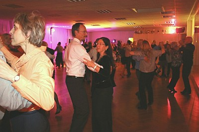

Die Herbstparty des TSC im VfL Sindelfingen am 29. November war ein voller Erfolg. Für das Gelingen dieses Abend waren wieder einmal mehrere Faktoren ursächlich. Im festlich hergerichteten Vereinheim konnte die Abteilungsleiterin Dr. Anja Westerhoff sogar noch mehr Mitglieder und Freunde des Tanzsportclubs begrüßen als im Vorjahr.

Durch das Programm führten die Organisatoren Monika und Gerhard Winkler. Unsere kleinsten Tänzer eröffneten mit ihrem Auftritt das Showprogramm. Gemeinsam mit ihrer Trainerin Victoria Kleinfelder hatten die 6-8 jährigen der Kindertanzgruppe dafür gleich drei Darbietungen vorbereitet und zeigten den rund 150 Gästen, dass Tanzen sehr viel Spaß macht. Nach einem reichhaltigen Buffet folgten weitere Programmpunkte. Zwei Dance-Styles Gruppen begeisterten das Publikum mit ihren abwechslungsreichen Choreografien und mitreißenden Rhythmen. Die Turniertanzpaare hatten sich für diesen Abend ebenfalls etwas besonderes ausgedacht. Sie zeigten neben den Einzelprogrammen aus allen fünf Standardtänzen eine gemeinsame Choreographie zu einem stimmungsvollen Langsamen Walzer und erhielten dafür sehr viel Applaus der Gäste.

Das Highlight des Abends war der Auftritt von Elazar Fayzulaev und Carolin Sommer. Mit einer Darbietung verschiedener Latein-Tänze ließen sie es auf der Tanzfläche ordentlich knistern.

Die Tanz- und Showband Filder-Express animierte die Mitglieder und Gäste mit toller Tanzmusik und sorgte zwischen und nach den Programmpunkten stets für eine volle Tanzfläche.

