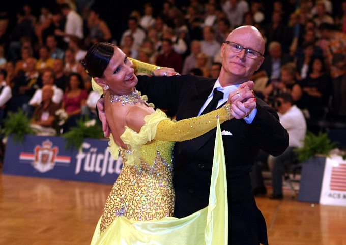

Die Paare des TSC im VfL Sindelfingen starten mit tollen Erfolgen ins neue Jahr.

Diane Mongellaz und Stefan Isenecker (Senioren II-S Standard) gingen zwei Mal in Bayern an den Start. Das erste Turnier war am 17. Januar das ErbersBergKristall-Turnier. Wie eng die einzelnen Paare in ihren Leistungen zusammen lagen, zeigte sich schon in der Zwischenrunde, aus der die Wertungsrichter sieben Paare in die Endrunde werteten. Natürlich waren Diane und Stefan mit dabei. Auch in der Endrunde machte das hohe Niveau und die ausgeglichene Leistunge der Finalpaare es den Wertungsrichtern schwer, so war es keine Überraschung, dass alle Paare durchweg mit den Platzziffern 1 bis 7 bewertet wurden. Die Endabrechnung ergab für Diane und Stefan den vierten Platz.

Das zweite Turnier am 25. Januar fand in München statt. Bei diesem Turnier ging es um den Horst und Ilse-Dore Galke-Gedächtnis-Wanderpokal. Nur Diane und Stefan und das spätere Siegerpaar zogen mit der maximalen Punktzahl ins Finale ein. Das extrem musikalische Tanzen und die tolle Paarwirkung brachten den beiden den zweiten Platz ein.

Anja und Frank Westerhoff fuhren am 17. Januar nach Sinsheim. Souverän überstanden die beiden in der Startklasse Senioren II-B Standard die Vor- und die Zwischenrunde und qualifizierten sich für das Finale. Ihr technisch sauberes und musikalisches Tanzen wurde mit dem sechsten Platz belohnt.

