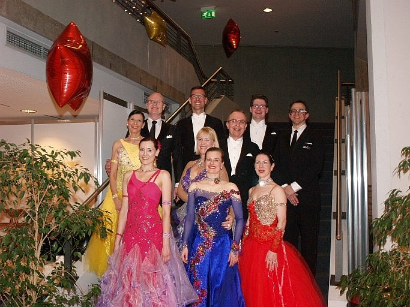

Die SZ/BZ lud am 31. Dezember in die Böblinger Congresshalle zu ihrer Silvesterparty ein. Damit läutete sie auch die Feierlichkeiten zu ihrem 125-jährigen Jubiläum ein. Mit dabei waren die Turnierpaare des TSC, um die Veranstaltung mit einer Showeinlage zu bereichern.

Das Publikum feierte begeistert den Auftritt unserer TSC-Paare, die mit einem schwungvollen und abwechslungsreichen Mix aus gemeinsamen Programmteilen und den Einzelchoreographien der aktuellen Turnierprogramme aus den Standardtänzen zeigten, wie sportlich und anmutig Tanzen sein kann. Nach lang anhaltendem Beifall folgte noch ein Wiener Walzer als Zugabe. Für den TSC tanzten Carolin Bieber und Christian Wolf, Anja und Frank Westerhoff, Alexander und Gisela Schürrmann, Sylvia und Lutz Benedix und Diane Mongellaz und Stefan Isenecker. Die Sindelfinger Böblinger Zeitung berichtete am 2.1.2015 unter anderem mit einem Bild unserer Paare auf der Titelseite über den Showauftritt.

[zum Artikel](http://www.szbz.de/nachrichten/artikel/detail/?tx_szbzallinone_szbznews[news]=1023241&tx_szbzallinone_szbznews[action]=show&tx_szbzallinone_szbznews[controller]=News&cHash=eb8b59471cfa374440c2de2917406da7)

