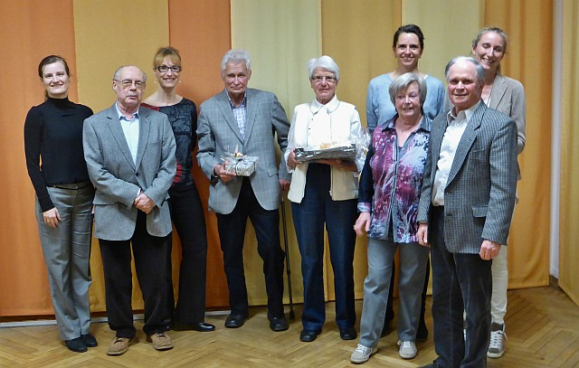

Ohne Probleme und im großen Einvernehmen gingen sowohl die Jungend- als auch die Mitgliederversammlung des TSC im VfL Sindelfingen über die Bühne. Die Clubleiterin, Dr. Anja Westerhoff, konnte in ihrem Bericht ein positives Fazit ziehen. Sie stellte fest, dass der TSC in jeder Hinsicht auf sicheren Füßen steht und für die Zukunft gerüstet ist.

Der Bericht des Kassenwarts und der Kassenprüfer bestätigten, dass der TSC finanziell gut aufgestellt ist und Investitionen in die Zukunft möglich sind. Erfreulicherweise konnte die Mitgliederzahl auch im vergangenen Jahr deutlich gesteigert werden, sodass der Tanzsportclub das Jahr mit deutlich über 500 Mitgliedern beenden konnte.

Auch aus dem sportlichen Bereich konnte positives berichtet werden,  denn die Reaktivierung des Turnierbereichs macht gute Fortschritte, sodass der Sportwart auf ein erfolgreiches Sportjahr zurückblicken konnte.

Die Präsidentin des VfL  Sindelfingen, Anette Bronder, lobte den Einsatz und die Zuverlässigkeit der Tanzsportabteilung und bedankte sich für die gute Zusammenarbeit. Mit besonderer Freude ehrte sie einige Mitglieder.

Für ihr jahrelanges Engagement wurde Suzana Köster-Manojlovic mit der Verdienstnadel in Silber des VfL Sindelfingen ausgezeichnet. Britta Sigmund wurde für 25 Jahre Mtgliedschaft im VfL Sindelfingen die Ehrennadel in Silber verliehen. Für 40-jährige Treue zum Tanzsportclub bedankte sich Dr. Anja Westerhoff bei Doris und Herbert Schöllmann, Renate und Rolf Zimmer, Anneliese und Alfred Keicher sowie Dieter Kühneweg. Alle Jubilare erhielten ein Geschenk des Tanzsportclubs.

