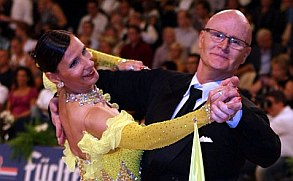
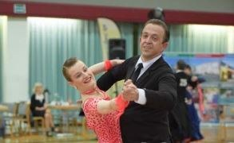

Die Paare des TSC sammeln weiter Erfolge. In Aachen tanzten 69 Paare der Startklasse Senioren II S-Standard am 13.6.2015 um Ranglistenpunkte. In diesem starken Feld mit dabei waren Diane Mongellaz und Stefan Isenecker. Die beiden erreichen das Viertelfinale und ließen damit an die 50 Paare hinter sich.

Anja und Frank Westerhoff brachten in Erfurt am 13. und 14.6.2015 mit insgesamt vier Turnieren einen Tanzmarathon hinter sich. In der Startklasse Senioren II-B Standard verpassten sie am ersten Tag mit Platz 7 knapp das Finale. Am Sonntag ertanzten sie sich den vierten Platz. Die beiden Turniere der Startklasse I-B Standard beenden Anja und Frank jeweils mit dem zweiten Platz.

