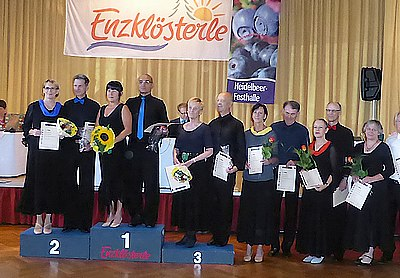

Ingrid und Bernd Peter hatten bei vielen Breitensportwettbewerben schon viel Erfahrung und viele Erfolge gesammelt. Jetzt hatten sie sich entschieden, bei offiziellen Turnieren an den Start zu gehen. Ihr erstes Turnier in der Startklasse Senioren III D-Standard fand am 26.Juli in Enzklösterle statt.

Durch ihr routiniertes Tanzen erreichten sie sicher die Endrunde. Im Finale konnten sie durch gekonntes und musikalisches Tanzen punkten. Sie lieferten sich einen spannenden Kampf um den zweiten Platz, mussten sich aber am Ende um einen Punkt geschlagen geben. Mit einem 3. Platz und der ersten Aufstiegsplatzierung konnten sie ihr erstes Turnier in der D-Klasse beenden.

