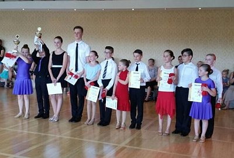

## 

  
Am 26. Juli veranstaltete das Tanzstudio ROYAL DANCE ein Turnier für Kinder- und Jugendpaare, die noch nicht an einem Tanzturnier teilgenommen haben. Dabei konnten Paare in allen Altersgruppen mitmachen. Fünf Wertungsrichter bewerteten, - unabhängig von der Choreographie - Haltung, Musikalität und Ausdruck der Paare. Für den TSC im VfL Sindelfingen war das Geschwisterpaar Lisa und Ben Englisch aus der Kindertanzgruppe von Victoria Kleinfelder am Start. Die beiden überzeugten mit ihrem sauberen und musikalischen Tanzen die Wertungsrichter und kamen bei ihrem ersten Turnier auf den 4. Platz.  

 

