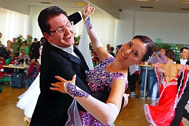
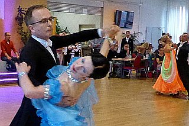

Ludwigsburg war der Austragungsort der Baden-Württembergischen Landesmeisterschaften 2015 in den Standardtänzen der Startklassen der Hauptgruppen II und der Senioren III . Vom TSC im VfL Sindelfingen nahmen zwei Paare teil.

Carolin Bieber und Christian Wolf Landesmeister der HGR II B

In der Hauptklasse II B war der TSC durch Carolin Bieber und Christian Wolf vertreten. Mit einer überzeugenden Leistung und fast allen Bestnoten der sieben Wertungsrichter ertanzten sie sich den Landesmeistertitel in der B-Klasse und stiegen damit in die Hauptklasse II A auf. Frisch aufgestiegen in die A Klasse, kamen Carolin und Christian bei der anschließenden Landesmeisterschaft der Hauptklasse II A auf den 6. Platz.

Sen III S

Dr. Alexander und Dr. Gisela Schürmann gingen in der Startklasse Senioren III S für den TSC an den Start. Auch dieses Paar zeigte eine gute Leistung, konnte in einem starken Teilnehmerfeld am Ende aber nicht in die Entscheidung des Turniers eingreifen.

