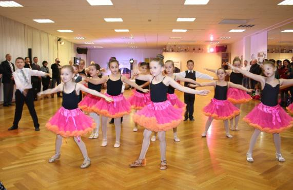

Am 21. September war der Tanzsportclub wieder Gast im Seniorenzentrum Haus Augustinus in Sindelfingen um einen Tanznachmittag zu gestalten.

Dieses Mal waren Paare unserer Breitensportgruppe und die Kindertanzgruppen von Victoria für die Durchführung verantwortlich. Den Bewohnern des Seniorenzentrums wurde ein kurzweiliges Programm angeboten.

Die Breitensportler begannen die Vorführung mit den Standardtänzen. Anschließend begeisterten die Kinder-Tanzgruppen mit ihren Formationen der Standard- und Lateintänze. Dann waren wieder die Breitensportler dran. Diese Mal brachen sie Lateintänze auf das Parkett.

Den Abschluss der tänzerischen Darbietungen bildeten zwei Breitsportpaare. Zu den Melodien „An der Nordseeküste“ von Klaus und Klaus und Peter Alexanders „Badewannentango“ tanzten sie Wiener Walzer und Tango. Allerdings taten sie das nicht mit ihren normalen Tanzschuhen, sondern auf Schwimmflossen und in Badeanzügen aus den zwanziger Jahren des vorigen Jahrhunderts.

Zum Abschluss bat das Puppentheater in die Oper. Gespielt wurde die wohl bekannteste Arie der Carmen, die Habanera aus der gleichnamigen Oper von Georges Bizet und als Kontrastprogramm das Kultlied aus der Sesamstraße Mana Mana. Nach einer guten Stunde mit einem bunten Unterhaltungsprogramm verabschiedeten sich die Mitglieder des Tanzsportclubs bis zum nächsten Tanznachmittag.

