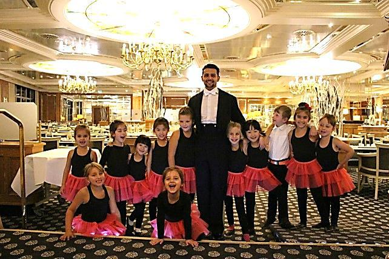

Am 17. Oktober fand im Maritim Hotel Stuttgart der festliche WIZO-Ball statt. Als Rahmenprogramm trat eine unserer Kindergruppen von Elazar auf. Die Kinder begeisterten das Ballpublikum mit einer Polka. Anschließend musste auch der Trainer ran. Zusammen mit Carolin Sommer tanzte Elazar Fayzlaev einen Langsamen Walzer.

WIZO ist eine weltweite Frauenorganisation, die in Israel ca. 800 Institutionen unterhält, in denen Frauen, Kinder, Jugendliche und alte Menschen, unabhängig von Religion und Herkunft, betreut werden. WIZO ist Mitglied von UNICEF.

