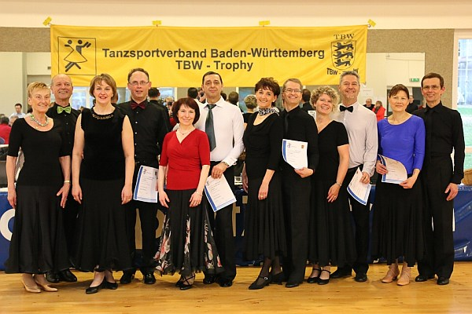

Unser Paar, Ingrid und Bernd Peter, das bisher im Breitensport trainierte, wollte es noch einmal wissen.

Nach der Ausstellung einer Startkarte für die Senioren Klasse III (55 bis 65 Jahre) ging es am 13.2. und am 14.2.2016 in Stuttgart Feuerbach bei der TBW Trophy an den Start.

Die Ausbeute des Wochenendes war bemerkenswert. Durch routiniertes und musikalisches Tanzen erreichten sie bei allen Turnieren des Wochenendes sicher das Finale. Am Samstag konnten sie von 15 Paaren in Sen III D den vierten Platz erreichen und im Finale den Langsamen Walzer sogar gewinnen. Am Sonntag kam es dann noch besser. Souverän tanzten sie das mit 11 Paaren besetzte Sen III D Turnier und gingen als Sieger von der Fläche. Als Gewinner durften sie in der nächst höheren Klasse, der Senioren III C, mittanzen. Dort ertanzten sie sich von 16 Paaren, nach Vor- und Zwischenrunde, in der Endrunde einen hervorragenden dritten Platz.

Mit drei Platzierungen (Platz 1 bis 6) und 36 Punkten brachte dieses Wochenende die beiden einen guten Schritt weiter zum Aufstieg in die Seniorenklasse III C Klasse. 

Wir gratulieren zu dieser tollen Leistung und wünschen weiterhin viel Erfolg.

[Photo TBW](http://www.tbw-trophy.de/siegerehrungen/)

