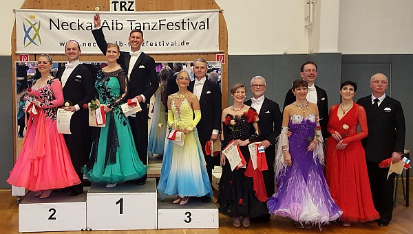

Im Rahmen des Neckar-Alb-Tanzfestivals wurden in Tübingen und Reutlingen Latein- und  
Standardturniere durchgeführt. Dabei war unser Tanzsportclub mit mehreren Paaren gut vertreten.

  
Am ersten Tag gingen in der Senioren III Sonderklasse Standard Lutz und Sylvia Benedix an den Start.  
In allen Tänzen konnten sie die Wertungsrichter überzeugen und zogen in das Finale ein. In diesem  
konnten sie ihre Leistungen nochmals steigern und ertanzten sich den ersten Platz. Mit allen  
gewonnenen Tänzen konnten sie stolz den Pokal und die Glückwünsche in Empfang nehmen.

Am gleichen Tag haben sich Elazar Fayzulaev und Carolin Sommer-Trembo nach Reutlingen auf den Weg  
gemacht, um ihr erstes gemeinsames Lateinturnier in der Hauptgruppe A zu bestreiten. Auf Anhieb  
haben die beiden sich für das Finale qualifiziert und dort einen tollen dritten Platz erreicht. Herzliche  
Glückwünsche!

Einen Tag später sind Bernd und Ingrid Peter zum Turnier nach Reutlingen aufgebrochen. Sie haben sich im Feld der Senioren III D Klasse sehr gut behaupten können und in diesem einen tollen zweiten Platz ertanzt. Auch dazu herzliche Gratulation.

1. Platz für Sylvia und Lutz Benedix am 12.03.2016 in Tübingen

