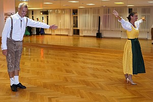

Tolle Stimmung bei unserer Herbstparty

Am vergangenen Samstag, den 15.10.2016, wurde unsere diesjährige Herbstparty, etwas früher als in den vergangenen Jahren, erfolgreich und mit großer Beteiligung der Tänzer von jung bis jung geblieben durchgeführt. Es sind ca. 95 Gäste zur Herbstparty gekommen und konnten sich an einem reichhaltigen kalten Buffet mit leckerem Desserts und natürlich tänzerischen Leckerbissen erfreuen.  
Zuerst haben uns unsere ganz Kleinen der Gruppe 1 gezeigt, was sie in der Stunde mit Viktoria Kleinfelder so gelernt haben. Mit viel Spaß und Freude präsentierten sie ihre erste Tanzdarbietung und genossen sichtlich den Applaus des Publikums und natürlich das Lob der Trainerin und der anwesenden Eltern.   
Weiter ging es mit den Gruppen 2 und 3, die uns mit ihren Standard- und Lateintänzen ein Lächeln auf die Lippen zauberten. Beide Gruppen konnten ebenfalls zeigen, was sie alles in den Stunden bei Viktoria gelernt haben. Bald, so verkündete Viktoria, wird auch ein Kinderpaar in das Turniergeschehen eintauchen. Wir wünschen alles Gute dafür!  
Allen Kindern danken wir für den tollen Auftritt und freuen uns schon auf die nächste Party.

Nachdem das Buffet gestürmt wurde und alle gesättigt waren, hat die Turniertanzgruppe des Trainers Rolandas Trembo ein kleines Showprogramm dem fachkundigen Publikum präsentiert.

Mit viel Anmut und Eleganz präsentierten sie die fünf Standardtänze und eine Polka um zwei lateinamerikanische Tänze herum. Die Paare haben sich das Programm selbst ausgedacht und hatten schon beim Proben viel Spaß dabei. Das Publikum honorierte die Darbietungen mit viel Applaus. Im Anschluss daran wurde das Publikum zum Wiener Walzer aufgefordert.  
Vielen Dank an alle Tänzerinnen und Tänzer, es war echt toll!

Das Highlight des Abends war die Tangoshow unseres Trainers Rolandas mit seiner Frau Carolin, die mit viel Leidenschaft und einer Portion tänzerischer Arroganz, wie es beim Tangotanz üblich ist, dargeboten wurde. Einmal mehr wurde gezeigt, wie toll Tanzen ist. Es war ein Augenschmaus!  
Vielen Dank an Rolandas und Carolin, es war fantastisch!



Musikalisch hat uns der „Filder Express“ durch den Abend begleitet und alle waren sich einig, die haben „Supermusik“ gespielt.   
Damit alles rund ablaufen konnte waren viele Helfer für den Auf- und Abbau, das Buffet, das Spülen, servieren etc. und überhaupt für die Organisation notwendig. Es lief alles super ab.   
Dafür gilt an alle unser herzliches Dankeschön!!

  
SBix 17.10.2016


  
  
  
  
  
  
  
  
  
  
  
  
  
  
  
  


