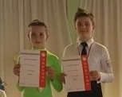

### 

Am vergangenen Wochenende, am 22. April 2017, haben sich unsere Jüngsten, Ben Englisch und Nicole Krom auf den Weg zum Turnier in Offenburg – Waltersweier gemacht, um am Lateinturnier der Junioren I D und II D teilzunehmen. Unter den Augen der Zuschauer und natürlich der Eltern haben die beiden ein tolles Tanzen präsentiert und konnten die Wertungsrichter davon überzeugen „Schaut her…wir gehören ins Finale…“ von insgesamt 12 gestarteten Paaren. In dem Finale wurden Ben und Nicole mit einem sehr guten 2. Platz für ihr fleißiges Training am Ende belohnt. Super, weiter so und lieben Dank an die Eltern!

Im zweiten Lateinturnier der Junioren II D, waren leider nur 3 Paare am Start. Hier haben Ben und Nicole ebenfalls einen tollen 2. Platz erreicht.

Herzlichen Glückwunsch und weiter so!

### 

In der Standardsektion sind Martin Herold und Dr. Manuela Reichert im neuen Outfit in St. Ingbert in der SEN II B an den Start gegangen. In dem Turnier um den INGO-Pokal, konnten sich die beiden im Feld von 14 gestarteten Paaren gut behauten und sicher die 1. Zwischenrunde erreichen. Am Ende haben Martin und Manuela ganz knapp (mit 1 Kreuz) den Einzug in das Finale verpasst, trotzdem können die beiden über ihren abschließenden 7. Platz sehr zufrieden sein.

Herzlichen Glückwunsch!

