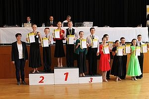
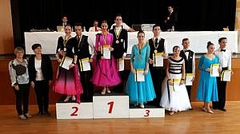

Am 23. September wurde die Landesmeisterschaft 2017 der Kinder, Junioren und Jugend in Holzgerlingen ausgetragen.

Mit dabei waren Ben Englisch / Nicole Krom bei den Jun I D Std und Jun. II D Std, sowie Jan Sommer / Laura Zezelj bei der Jug. C Std.

Als erstes gingen Ben Englisch und Nicole Krom bei den Junioren I D und Junioren II D Standard an den Start.

Bei beiden Turnieren erreichten sie in allen Tänzen sicher den dritten Platz.

Am Nachmittag waren Jan Jan Sommer und Laura Zezelj bei der Jugen C Standard dabei. Sie errangen sicher in allen vier Tänzen den ersten Platz und sicherten sich damit den Sieg in der Landesmeisterschaft und den Aufstieg in die Jugend B Standard Gruppe.

Fotos: TBW

Einen Herzlichen Glückwunsch allen Teilnehmern!!

