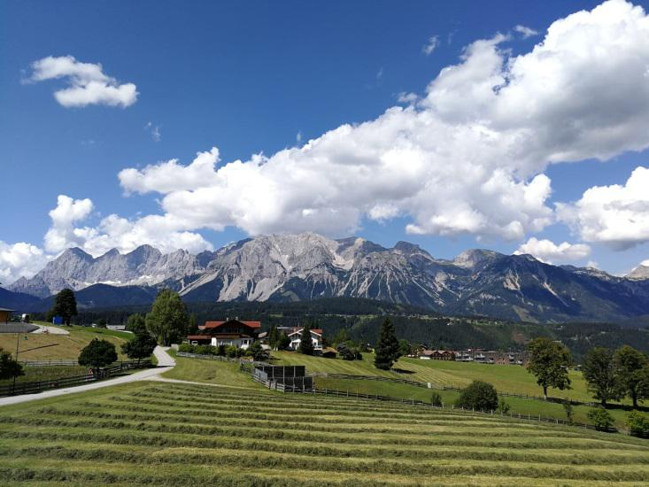

WDSF-Turnier DER SEN III S in Schladming  
Schladming, ein wunderschöner Ort in den Bergen von Österreich, ja nicht nur ein Ort zum Wandern und Ski fahren, nein auch Austragungsort eines sehr schönen Tanzturniers „Alpine-Cup-Schladming“.

Zu diesem wunderschönen Ort haben sich unsere Tänzer Diane Mongellaz und Stefan Isenecker auf den Weg gemacht, um das Turnier der Senioren III S Standard mit weiteren 54 nationalen und internationalen Paaren zu bestreiten. Guter Stimmung und mit dem tollen Ergebnis der GOC in Stuttgart im Nacken, konnten Diane und Isi sich von Runde zu Runde steigern und am Ende das Turnier mit einem sehr guten 18. Platz beenden.   
Herzlichen Glückwunsch dazu!

SBix 22.08.2018

