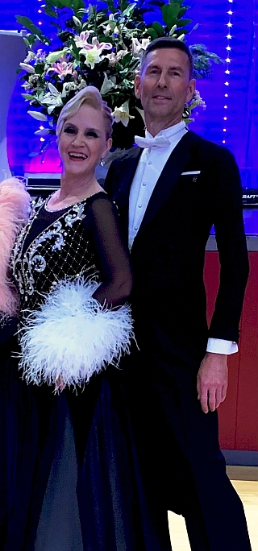

Am **12. und 13. November** fanden in Dresden die Saxonian Dance Classics 2022 mit vier WSDF Senioren-Turnieren im Programm statt.

Bei schönstem sonnigen Herbstwetter startete am Sonntagnachmittag das Turnier der **Senioren III** mit insgesamt 107 Paaren. Es war das größte Starterfeld an diesem Wochenende.

Mit dabei außer den amtierenden Weltmeistern auch unser Paar **Sylvia** und **Lutz Benedix**. Die beiden tanzten unbeeindruckt von der Stärke des Feldes ihr bestes Turnier bislang und konnten sich sicher für die Runde der letzten 48 Paare qualifizieren.

Mit **Platz 46** in der Endabrechnung waren sie sehr glücklich. Zumal das ‚Losglück‘ ihnen in jedem Tanz mehrere Finalpaare in der gleichen Runde auf dem Parkett bescherte. Alles in allem war es für sie sehr schönes und hochklassiges Turnier in toller Umgebung das sie genossen haben.

mz

