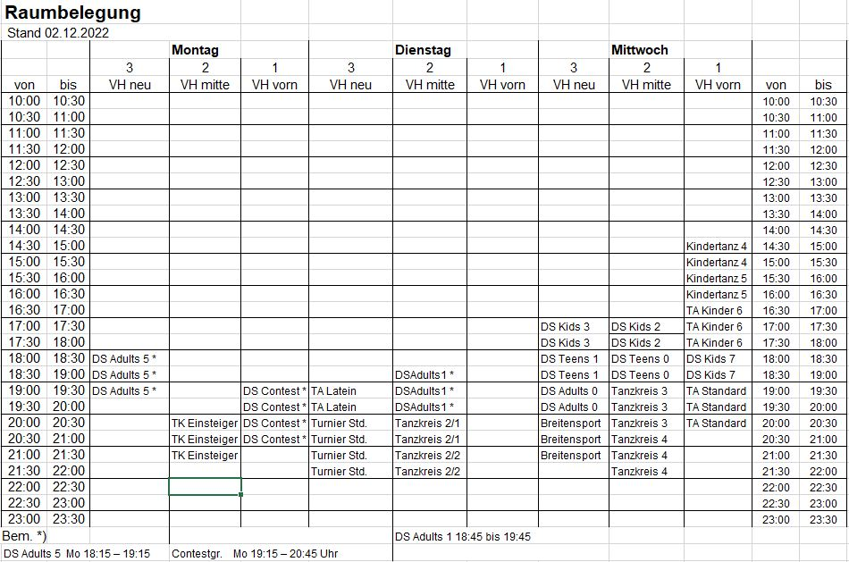
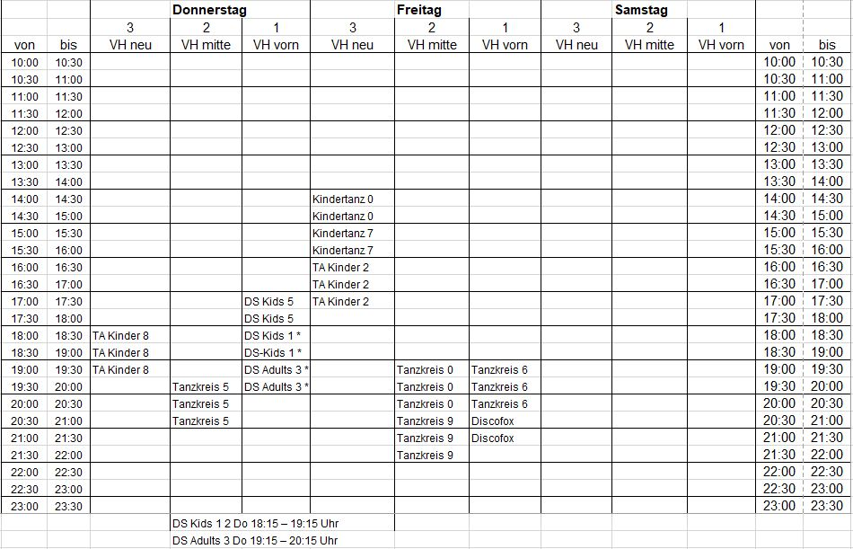

Hier finden Sie die Übersicht zur aktuellen Belegung unserer Tanzsäle. 

## Raumbelegung - planmäßig

Stand 02.12.2022

Die komplette Saalbelegung als PDF herunter laden.

## Raumbelegung außerplanmäßig 
Außerhalb der Trainings- und Kurszeiten können die Räume für freies Training gebucht werden.

Um die Verfügbarkeit für alle Mitgieder transparent zu halten und Überschneidungen zu vermeiden, sollte jede außerplanmäßige Belegung eines Saals frühzeitig eingetragen werden. 

### Belegungsplan heute
https://cloud.tsc-vfl.de/index.php/apps/calendar/embed/d5KikZAZJfJxMHyK-RyoP44ym84oa5NFm-8DBYtgZwmkDsdemr/timeGridWeek/now



### Regeln für die Belegung der Tanzsäle
**Die Nutzung der Säle ist ausschließlich zum Zwecke des Tanztrainings erlaubt.**

Es gelten die folgenden Regeln für die außerplanmäßige Belegung eines Saals: 

+ Die Raumreservierung muss mindestens zwei Tage vor dem geplanten Termin eingetragen werden
+ Anzugeben sind Saal, Uhrzeit, Dauer und verantwortliche Person
+ Die Säle "vorne" und "mitte" stehen für die Reservierung zur Verfügung. Der Neue Saal ist nur in Ausnahmefällen zu buchen
+ In Ausnahmefällen kann der Neue Saal nach Genehmigung durch die Abteilungsleitung (clubleiter@tanzsportclub.vfl-sindelfingen.de) oder den Sportwart (sportwart@tanzsportclub.vfl-sindelfingen.de) reserviert werden

#### Außerhalb der Schulferien:
1. Die reguläre Raumbelegung hat immer Vorrang.
2. Es muss immer ein Saal für das freie Training verfügbar bleiben.  
Ausnahme: größere Clubveranstaltung, wie z.B. Jahresauftakt

#### Sonderbedingungen während der Schulferien:
1. Die reguläre Raumbelegung ist aufgehoben, Ausnahme: Ballettzeiten
2. Gruppenunterrichte zu den "üblichen Zeiten" müssen als außerordentliche Raumbelegung reserviert werden
3. Für sonstige außerordentliche Raumbelegungen gelten die obigen Regeln

### Wer kann einen Saal buchen? 
Die außerplanmäßige Raumreservierung kann von folgenden Personenn vorgenommen werden: 

+ Abteilungsleiter, Sportwart, Kassenwart, Dancestyles-Trainerinnen, Homepage-Team, Veranstaltungswart, Gebäudewart

Um einen Saal buchen zu können, ist ein Account in unserer Vereinsplattform "TSC Cloud Kalender" notgwendig.
Um diesen Account zu erhalten, wende dich bitte per E-Mail die Abteilungsleitung mit folgenden Angaben: 
- vollständiger Name
- die gewünschte E-Mailadresse für den Account 
- sowie das Stichwort "Registrierung Raumbuchung"

Du erhältst alle nötigen Informationen direkt per E-Mail.